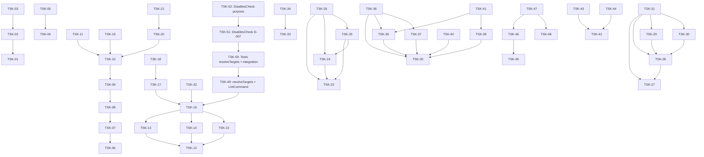

# Project Tasks

## Entry Points

- [Specs Portal](../specs/README.md) — Scope Graph + all scope specs.
- Tickets are picked up ONLY via `sdd-execute`. After `[x] DONE`, run `sdd-audit`.

## Project-Wide Conventions

### File-header Convention

Per `AX_FILE_HEADER_TASK_TRACEABILITY`:

```
// @file: <what the file holds>
// @consumers: <consumer-1, consumer-2, ...>
// @tasks: TSK-01, TSK-02
```

### Completion Rule (baseline)

A task cannot transition to `[x] DONE` until ALL of:

1. Every BDD scenario mapped to test ownership in §4 OR has `Deferred Test Ownership: <task-id>`.
2. Verification commands executed; results + exit codes recorded in Execution Log.
3. Canonical case names match real test cases or ticket updated.
4. `Deferred Runtime Scope` recorded if applicable.
5. Every introduced-beyond-Inventory entity logged as `Introduced <Name> because <reason>`.

Task-specific additions live in each ticket's §3.

### Execution Log Template

Per `AX_EXECUTION_LOG_PLAN_VS_FACT`. Each round = one open-to-DONE cycle; append-only; old rounds NEVER edited.

**Plan format (scaffolding pre-fills per ticket):**

```markdown
### Round 1 — <YYYY-MM-DD>, initial

- [ ] `[<ts>]` Task initialized.
- [ ] `[<ts>]` Implementation file: `<path>`.
- [ ] `[<ts>]` Test file: `<path>`.
- [ ] `[<ts>]` Verification: `<command>` → `<pass|fail>` [`exit=<code>`].
- [ ] `[<ts>]` Scenario coverage: `<scenario>` → `<test-file>::<case>`.
- [ ] `[<ts>]` Self-audit: walked loaded rule axioms against generated code. Violations: `<list or "none">`.
- [ ] `[<ts>]` Introduced (if any): `<Entity>` because `<reason>`.
- [ ] `[<ts>]` Tracker synced: `tasks/<scope>/README.md` + `tasks/README.md`.
- [ ] `[<ts>]` Status: [x] DONE.
```

⛔ `[x]` line with any unreplaced `<…>` literal = fabricated done.

### Post-task Hook

After `[x] DONE`, invoke `sdd-audit` on the ticket. Until audit returns PASS, round is closed-but-unverified.

## High-Level DAG



## Tracker Index

| Scope             | Type           | Tracker                               | Tasks | Done  |
| ----------------- | -------------- | ------------------------------------- | ----- | ----- |
| dbc               | library        | [README](dbc/README.md)               | 14    | 14/14 |
| cli               | product        | [README](cli/README.md)               | 17    | 17/17 |
| vcs               | product        | [README](vcs/README.md)               | 5     | 5/5   |
| agent-mon         | library        | [README](agent-mon/README.md)         | 7     | 7/7   |
| agent-mon-cli     | product        | [README](agent-mon-cli/README.md)     | 4     | 0/4   |
| infra-npm-publish | infrastructure | [README](infra-npm-publish/README.md) | 3     | 3/3   |

## Decision Log

None — all default choices.
