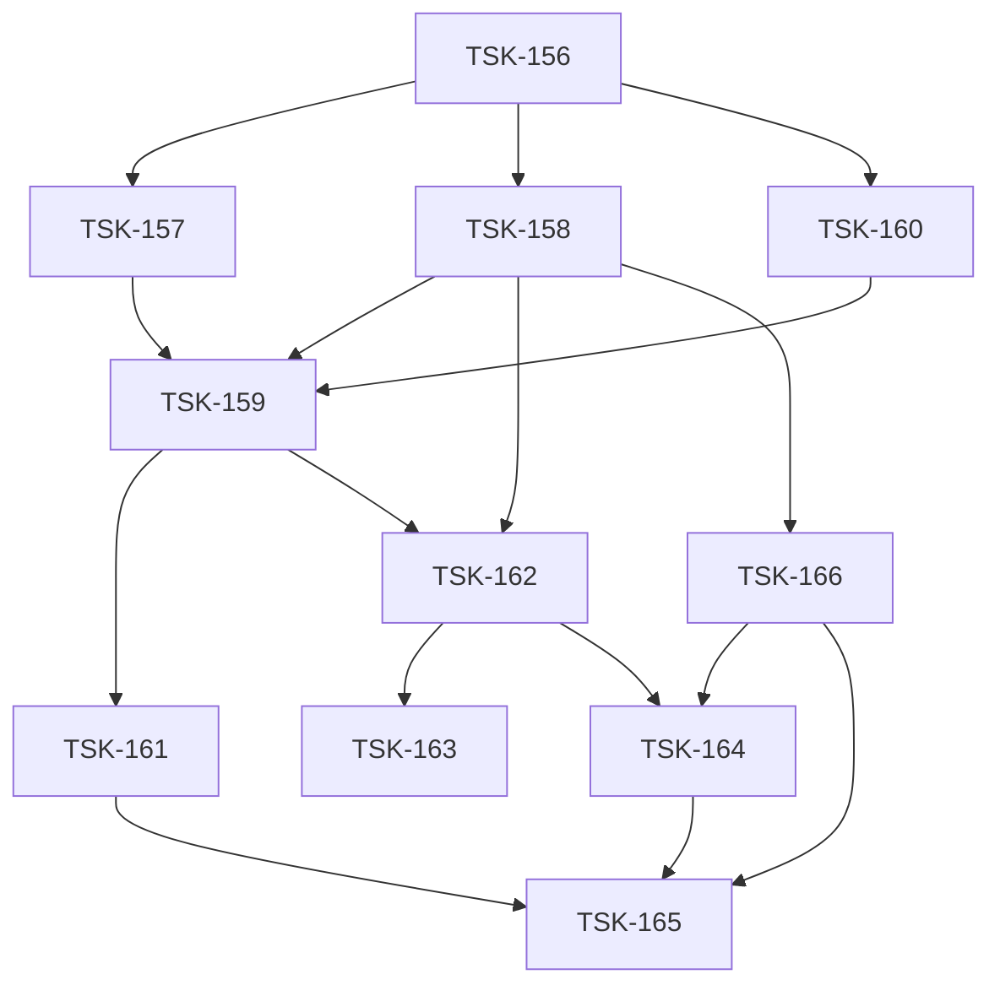

# Tasks: agent-inbox

> v2 DAG (TSK-156…165) под спеки v2 ([корневая](../../specs/agent-inbox/agent-inbox.spec.md), D-301…D-331).
> v1 DAG (TSK-80…155) удалён решением оператора 2026-07-29 (D-216 в [../README.md](../README.md)).

## Scope Spec

- [agent-inbox.spec.md](../../specs/agent-inbox/agent-inbox.spec.md) · модульные: inbox-core / inbox-vcs / inbox-queue / inbox-pipeline / inbox-opencode / inbox-chat / inbox-api / inbox-dashboard / inbox-eval

## Cascade Table

| Tier                                        | coding           | testing                                    | infra |
| ------------------------------------------- | ---------------- | ------------------------------------------ | ----- |
| infra-base, vcs, cli, ai-skills (traversed) | typescript-rules | node-test (+testing-common)                | —     |
| agent-inbox (target, §11)                   | typescript-rules | node-test, playwright-cli → playwright-e2e | —     |
| module:<name> (Handoff additions)           | typescript-rules | node-test (+playwright для dashboard)      | —     |

### Rule Sources

- Traversed: [scope graph](../../specs/README.md)
- Target: [agent-inbox.spec.md §11](../../specs/agent-inbox/agent-inbox.spec.md)
- Module: Handoff Rules Additions каждой модульной спеки

## Intra-Scope DAG

## Tracker

| Task-ID                            | Title                                          | Module          | Dependencies              | Status     |
| ---------------------------------- | ---------------------------------------------- | --------------- | ------------------------- | ---------- |
| [TSK-156](agent-inbox.task-156.md) | Bootstrap: журнал событий + layout             | inbox-core      | None                      | `[x]` DONE |
| [TSK-157](agent-inbox.task-157.md) | inbox-core: датасет решений + готовность       | inbox-core      | TSK-156                   | `[x]` DONE |
| [TSK-158](agent-inbox.task-158.md) | inbox-vcs: sync + внимание + эффекты           | inbox-vcs       | TSK-156                   | `[x]` DONE |
| [TSK-159](agent-inbox.task-159.md) | inbox-queue: реестр типов + executors          | inbox-queue     | TSK-157, TSK-158, TSK-160 | `[ ]` TODO |
| [TSK-160](agent-inbox.task-160.md) | inbox-opencode: TTL-паркинг + пул + промпты    | inbox-opencode  | TSK-156                   | `[ ]` TODO |
| [TSK-161](agent-inbox.task-161.md) | inbox-pipeline: план + слои + линзы + гейты    | inbox-pipeline  | TSK-159                   | `[ ]` TODO |
| [TSK-162](agent-inbox.task-162.md) | inbox-api: REST/SSE + DTO-проекции             | inbox-api       | TSK-158, TSK-159          | `[ ]` TODO |
| [TSK-163](agent-inbox.task-163.md) | inbox-chat: якоря + operator-сессия + мутации  | inbox-chat      | TSK-162                   | `[ ]` TODO |
| [TSK-164](agent-inbox.task-164.md) | inbox-dashboard: загрузка/доска/лента/чат      | inbox-dashboard | TSK-162, TSK-166          | `[ ]` TODO |
| [TSK-165](agent-inbox.task-165.md) | inbox-eval: харнесс S1–S8 + метрики            | inbox-eval      | TSK-161, TSK-164, TSK-166 | `[ ]` TODO |
| [TSK-166](agent-inbox.task-166.md) | test-infra: seed-DSL + контракт-сьют + кассеты | test-infra      | TSK-156, TSK-158          | `[ ]` TODO |

## Notes

- Верификация фаз: `npm run type-check` (typescript-rules), `npm test` (node-test), `npm run format:check`; dashboard e2e — `npx playwright test --config=e2e/inbox-serve/playwright.review-flow.config.ts`.
- Приёмка продуктовая — на реальном MR (inbox-eval, без моков).
