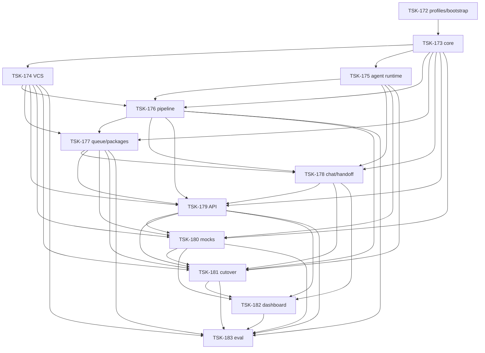

# Tasks: agent-inbox

## Scope Spec

- [Root](../../specs/agent-inbox/agent-inbox.spec.md)
- Navigation: [review runtime](../../specs/agent-inbox/review-runtime/index.md), [operator assistant](../../specs/agent-inbox/operator-assistant/index.md), [verification](../../specs/agent-inbox/verification/index.md)

## Cascade Table

| Tier                                     | coding             | testing                                                   | architecture                       | infra              |
| ---------------------------------------- | ------------------ | --------------------------------------------------------- | ---------------------------------- | ------------------ |
| infra-base/vcs/cli/ai-skills (traversed) | typescript-rules   | testing-common, node-test                                 | —                                  | existing toolchain |
| agent-inbox (target)                     | typescript-rules   | testing-common, node-test, playwright-cli, playwright-e2e | journal-first hexagonal boundaries | —                  |
| module                                   | None beyond target | dashboard/eval add Playwright                             | None                               | None               |

### Rule Sources

- [Scope graph](../../specs/README.md)
- [Agent Inbox rules](../../specs/agent-inbox/agent-inbox.spec.md#45-rules)
- [Rule registry](../../ai/directives/knowledge.xml)

## Intra-Scope DAG

Edge = prerequisite → dependent.

## Tracker

| Task-ID                                                | Title                          | Module          | Dependencies        | Status     |
| ------------------------------------------------------ | ------------------------------ | --------------- | ------------------- | ---------- |
| [TSK-172](agent-inbox.task-172.md)                     | Runtime profiles/bootstrap     | scope           | None                | `[x]` DONE |
| [TSK-173](inbox-core/inbox-core.task-173.md)           | Canonical review state         | inbox-core      | 172                 | `[x]` DONE |
| [TSK-174](inbox-vcs/inbox-vcs.task-174.md)             | Unified GitLab boundary        | inbox-vcs       | 173                 | `[x]` DONE |
| [TSK-175](inbox-opencode/inbox-opencode.task-175.md)   | Agent runtime contracts        | inbox-opencode  | 173                 | `[x]` DONE |
| [TSK-176](inbox-pipeline/inbox-pipeline.task-176.md)   | Deterministic review control   | inbox-pipeline  | 173–175             | `[x]` DONE |
| [TSK-177](inbox-queue/inbox-queue.task-177.md)         | Packages and automation        | inbox-queue     | 173,174,176         | `[x]` DONE |
| [TSK-178](inbox-chat/inbox-chat.task-178.md)           | Chat and DEV handoff           | inbox-chat      | 173,175–177         | `[x]` DONE |
| [TSK-179](inbox-api/inbox-api.task-179.md)             | Journal projections/API        | inbox-api       | 173,174,176–178     | `[x]` DONE |
| [TSK-180](inbox-mocks/inbox-mocks.task-180.md)         | Deterministic mock runtime     | inbox-mocks     | 173–175,177,179     | `[ ]` TODO |
| [TSK-181](agent-inbox.task-181.md)                     | Runtime cutover/legacy removal | scope           | 174–180             | `[ ]` TODO |
| [TSK-182](inbox-dashboard/inbox-dashboard.task-182.md) | Carbon & Steel cockpit         | inbox-dashboard | 178–181             | `[ ]` TODO |
| [TSK-183](inbox-eval/inbox-eval.task-183.md)           | Adaptive product acceptance    | inbox-eval      | 174,176,177,179–182 | `[ ]` TODO |

## External prerequisites

- Existing GitLab token/identity and OpenCode-compatible runtime.
- Real-effects eval remains disabled until an explicit project/MR allowlist is configured.
- Browser clipboard permission is observed at runtime and is not a bootstrap blocker.

## Requirement Coverage

| Root requirements                              | Owning tasks                                                                    |
| ---------------------------------------------- | ------------------------------------------------------------------------------- |
| FR-001…005 discovery/lifecycle/placement       | TSK-173, TSK-174, TSK-179, TSK-182                                              |
| FR-006…009 full and cross-review               | TSK-176 contracts; TSK-183 named real-MR cross-review e2e                       |
| FR-010…015 event accumulation/delta            | TSK-173, TSK-174, TSK-176, TSK-177                                              |
| FR-016…027 packages/effects/automation         | TSK-174, TSK-176, TSK-177, TSK-179, TSK-182                                     |
| FR-028…032 DEV handoff                         | TSK-178, TSK-179, TSK-182                                                       |
| FR-033…037 dashboard/workspace/chat            | TSK-179, TSK-182                                                                |
| FR-038…043 isolated/adaptive tests             | TSK-172, TSK-180, TSK-183                                                       |
| FR-002 auto-hide/history/reactivation          | TSK-173 lifecycle truth table → TSK-179 API projection → TSK-182 board/history  |
| FR-007 six full-review lenses                  | TSK-176 `every participation gets full review` + `six lenses` mapping           |
| FR-021 resolve/reopen ownership                | TSK-174 permission truth table; TSK-177 automation truth table                  |
| FR-023 approval makes open thread non-blocking | TSK-176 approval/thread semantics                                               |
| FR-026 author-refusal alternatives             | TSK-176 cross-review/refusal; TSK-177 exclusive choices                         |
| FR-042 adaptive statuses never weaken PASS     | TSK-183 status/report contract and mandatory PASS gate                          |
| FR-043 effect allowlist cannot broaden         | TSK-172 profile gate; TSK-174 negative gates; TSK-183 real-effects boundary     |
| FR-044…051 manifest/contract/slots/repair      | TSK-176 runtime/contracts; TSK-183 eleven named shippable-entry pipeline cases  |
| FR-048 completeness versus independent command | TSK-176 classifies refs; TSK-177 proves own gates/reroute/zero-effect branches  |
| FR-052 local freshness/effect boundary         | TSK-176 guards verdict/publication/handoff; TSK-177/174 dispatch reconciliation |
| FR-053 trusted runtime receipts                | TSK-175 observed operations; TSK-176 durable receipt and consumption trust gate |
| FR-054 monotonic repair budget                 | TSK-176 default-three persisted attempts and explicit operator continuation     |
| NFR-001 local single-process operator          | TSK-172, TSK-181                                                                |
| NFR-002 real runtime in first useful version   | TSK-174, TSK-175, TSK-181, TSK-182, TSK-183                                     |
| NFR-003 per-MR independence                    | TSK-177, TSK-181, TSK-183 acceptance 2                                          |
| NFR-004 crash-safe recovery/no blind repeat    | TSK-173, TSK-174, TSK-177, TSK-179, TSK-181, TSK-183                            |
| NFR-005 provenance                             | TSK-173, TSK-175, TSK-176, TSK-177, TSK-178, TSK-179                            |
| NFR-006 lifecycle observability                | TSK-179, TSK-182                                                                |
| NFR-007 ports only at real boundaries          | TSK-173…180 contract suites; TSK-181 cutover                                    |
| NFR-008 real-data visual acceptance            | TSK-182, TSK-183 acceptance 7                                                   |
| NFR-009 Carbon & Steel                         | TSK-182                                                                         |
| NFR-010 deterministic structural completeness  | TSK-176 matrix; TSK-183 named validator/orchestrator e2e                        |
| NFR-011 semantic quality cannot weaken slots   | TSK-176 boundary; TSK-183 named cross-review/synthesis e2e                      |
| NFR-012 crash-resumable targeted repair        | TSK-176 state; TSK-183 named repair resume/budget e2e                           |
| NFR-013 receipts durable before eligibility    | TSK-176 contracts; TSK-183 named store/adapter/recorder e2e                     |

## Historical baseline

TSK-156…170 remain immutable `[x] DONE` evidence for v2 implementation. They are superseded as execution guidance by TSK-172…183 and are not dependencies of the pivot DAG.

TSK-176 owns the exact immutable pipeline publication shape. Queue-side `ReviewGuardedIntent` assignability, byte-equivalent acceptance/no-translation and independent-command execution belong to dependent TSK-177; the DAG remains `TSK-176 → TSK-177`, never the reverse.

TSK-183 owns eleven separate named shippable-entry pipeline cases backreferenced verbatim from TSK-176: receipt store, local adapter, recorder, validator, repair, freshness, orchestrator, delta, real-MR cross-review, synthesis and publication handoff. No umbrella e2e can replace an individual PASS.

## Decision Log

- **D-219:** New IDs preserve historical audit evidence while regenerating the pivot DAG from current specs.
- **D-220:** One ticket per module spec; composition cutover is separate because it owns the cross-module migration and legacy deletion.
- **D-221:** Cross-ticket proof flows only forward: TSK-176 pipeline shape → TSK-177 queue acceptance/gates → TSK-183 named real-entrypoint acceptance; no dependency inversion.
