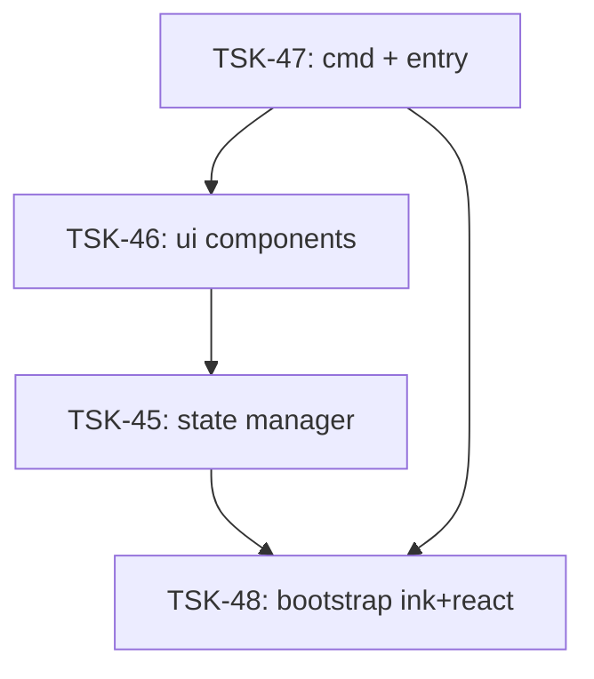

# Tasks: agent-mon-cli

## Scope Spec

- [Scope spec](../../specs/agent-mon-cli/agent-mon-cli.spec.md)

## Cascade Table

| Tier                   | coding           | testing   | architecture | infra |
| ---------------------- | ---------------- | --------- | ------------ | ----- |
| infra-base (traversed) | typescript-rules | node-test | —            | —     |
| agent-mon (traversed)  | typescript-rules | node-test | —            | —     |
| agent-mon-cli (target) | typescript-rules | node-test | —            | —     |

## Intra-Scope DAG

## Tracker

| Task-ID                          | Title                                   | Module | Dependencies   | Status     |
| -------------------------------- | --------------------------------------- | ------ | -------------- | ---------- |
| [TSK-48](bootstrap.task-48.md)   | Установка ink + react + @types/react    | N/A    | —              | `[ ]` TODO |
| [TSK-45](state/state.task-45.md) | State manager + ViewModel + waiting     | state  | TSK-48         | `[ ]` TODO |
| [TSK-46](ui/ui.task-46.md)       | Ink-компоненты: ColumnView, SessionCard | ui     | TSK-45         | `[ ]` TODO |
| [TSK-47](cmd/cmd.task-47.md)     | CLI entry + gennady.ts integration      | cmd    | TSK-46, TSK-48 | `[ ]` TODO |

## Notes

- TSK-48 (bootstrap) блокирует все —必须先 установить ink+react
- TSK-45 (state) — чистые функции, тестируется без ink
- TSK-46 (ui) — ink-компоненты, требуется ink для рендера
- TSK-47 (cmd) — composition root, связывает всё воедино
