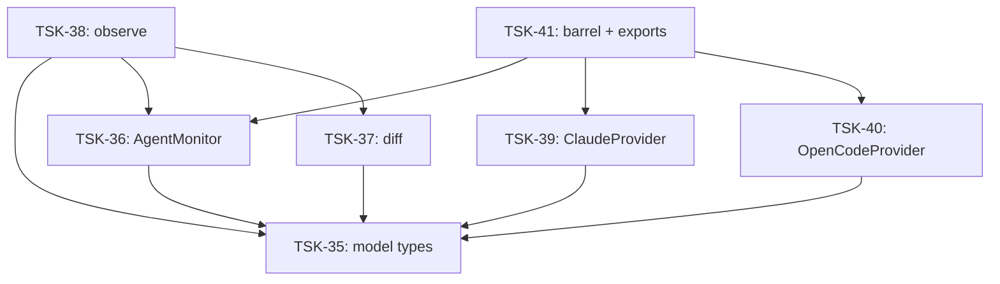

# Tasks: agent-mon

## Scope Spec

- [Scope spec](../../specs/agent-mon/agent-mon.spec.md)

## Cascade Table

Effective rules for tasks in this scope. Derived from scope graph (depends-on transitive closure).

Tier order (low → high priority on collision): `traversed-scopes` → `target-scope` → `module:<name>` → `task`.

| Tier                   | coding           | testing   | architecture | infra |
| ---------------------- | ---------------- | --------- | ------------ | ----- |
| infra-base (traversed) | typescript-rules | node-test | —            | —     |
| agent-mon (target)     | typescript-rules | node-test | —            | —     |

### Rule Sources

- Traversed scopes: [scope graph](../../specs/README.md)
- Target scope: [agent-mon spec §3.5](../../specs/agent-mon/agent-mon.spec.md#35-rules)
- Files: `ai/directives/coding/typescript-rules.xml`, `ai/directives/testing/node-test.xml`

## Intra-Scope DAG

## Tracker

| Task-ID                                          | Title                        | Module             | Dependencies           | Status     | Reopens |
| ------------------------------------------------ | ---------------------------- | ------------------ | ---------------------- | ---------- | ------- |
| [TSK-35](model/model.task-35.md)                 | Типы и контракты agent-mon   | model              | —                      | `[x]` DONE | 0       |
| [TSK-36](monitor/monitor.task-36.md)             | AgentMonitor: ядро и фабрика | monitor            | TSK-35                 | `[x]` DONE | 0       |
| [TSK-37](diff/diff.task-37.md)                   | diff: сравнение снапшотов    | diff               | TSK-35                 | `[x]` DONE | 0       |
| [TSK-38](observe/observe.task-38.md)             | observe: async iterable      | observe            | TSK-35, TSK-36, TSK-37 | `[x]` DONE | 0       |
| [TSK-39](providers/claude/claude.task-39.md)     | ClaudeProvider               | providers/claude   | TSK-35                 | `[x]` DONE | 0       |
| [TSK-40](providers/opencode/opencode.task-40.md) | OpenCodeProvider             | providers/opencode | TSK-35                 | `[x]` DONE | 0       |
| [TSK-41](../agent-mon.task-41.md)                | Корневой barrel + exports    | N/A                | TSK-36, TSK-39, TSK-40 | `[x]` DONE | 0       |

## Notes

- Bootstrap Requirements: Node.js ≥ 22.5 — `external-prereq-scope` (covered by infra-base). Claude/OpenCode file bootstraps — `operator-action`. No Phase 0 tickets needed.
- `node:sqlite` используется только в TSK-40 (OpenCode)
- Провайдеры (TSK-39, TSK-40) независимы, можно параллельно
