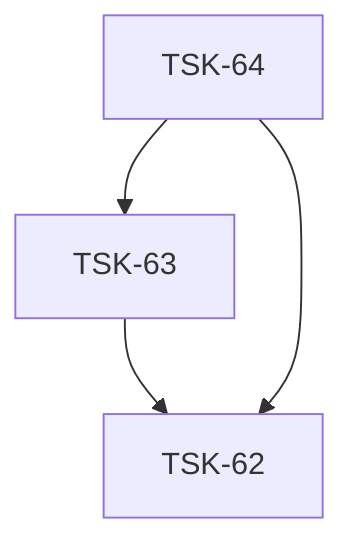

# Tasks: agent-run

## Scope Spec

- [Scope spec](../../specs/agent-run/agent-run.spec.md)
- Modules: [core](../../specs/agent-run/core/core.spec.md), [opencode](../../specs/agent-run/opencode/opencode.spec.md)

## Cascade Table

Effective rules for tasks in this scope. Derived from scope graph (depends-on transitive closure).

Tier order (low → high priority on collision): `traversed-scopes` → `target-scope` → `module:<name>` → `task`.

| Tier                   | coding           | testing   | architecture | infra |
| ---------------------- | ---------------- | --------- | ------------ | ----- |
| infra-base (traversed) | typescript-rules | node-test |              |       |
| agent-run (target)     | typescript-rules | node-test |              |       |
| module:core            | —                | —         | —            | —     |
| module:opencode        | —                | —         | —            | —     |

### Rule Sources

- Traversed scopes: [scope graph](../../specs/README.md) — `agent-run --> infra-base`
- Target scope: [agent-run §3.5 Rules](../../specs/agent-run/agent-run.spec.md#35-rules)
- Module: each module's §10 Handoff — Module Rules Additions: None
- Files: `ai/directives/<category>/<rule>.xml`

## Intra-Scope DAG

Edge A→B = «A depends on B». TSK-63 (opencode) → TSK-62 (core). TSK-64 (model) → оба.

## Tracker

| Task-ID                                | Title                     | Module   | Dependencies | Status     | Reopens |
| -------------------------------------- | ------------------------- | -------- | ------------ | ---------- | ------- |
| [TSK-62](core/core.task-62.md)         | Implement core module     | core     | None         | `[x]` DONE | 0       |
| [TSK-63](opencode/opencode.task-63.md) | Implement opencode engine | opencode | TSK-62       | `[x]` DONE | 0       |
| [TSK-64](agent-run.task-64.md)         | Model selection           | core + opencode | TSK-62, TSK-63 | `[ ]` TODO | 0       |

## Notes

- **External prerequisite (operator-action):** `opencode` CLI должен быть в PATH для integration/e2e фаз TSK-63. Отсутствие штатно обрабатывается как `AGENT_NOT_INSTALLED`. Для e2e — снять прокси-переменные (`unset HTTPS_PROXY`).
- **Bootstrap:** отдельного bootstrap-тикета нет — npm-зависимостей ноль (`node:child_process`), папка `services/agent-run/` создаётся при записи файлов TSK-62.
- **`index.ts` (composition root)** создаётся в TSK-63 (регистрирует `OpencodeEngine` в реестре + re-export публичной поверхности) — он зависит от обоих модулей.
- **BDD-failure-modes** взяты из 4 раундов sdd-critic (таймаут, прокси оба регистра, рассинхрон версий, ENOENT/EACCES, SIGKILL, сбой профиля) вместо отдельного BDD-review субагента — экономим проход, источник адекватен.
