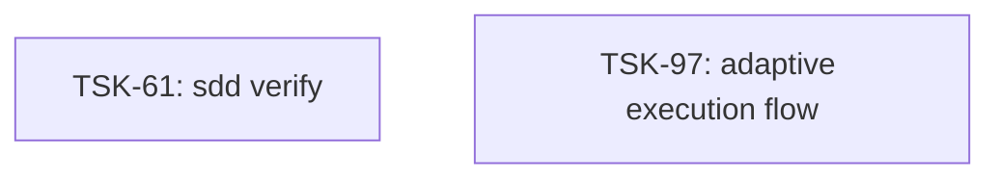

# Tasks: ai-skills

## Prefix

`AI` — derived from `ai-skills` per `AX_TASK_ID_UNIQUENESS`.

Last prefix: 000

## Scope Spec

- [Scope spec](../../specs/ai-skills/ai-skills.spec.md)

## Cascade Table

Effective rules for tasks in this scope. Derived from the scope graph and transitive rule dependencies.

| Tier               | coding           | testing   | architecture | infra            |
| ------------------ | ---------------- | --------- | ------------ | ---------------- |
| ai-skills (target) | typescript-rules | node-test | —            | nodejs-npm-setup |

### Rule Sources

- Target scope: [ai-skills spec §3.5](../../specs/ai-skills/ai-skills.spec.md)
- Files: `ai/directives/coding/typescript-rules.xml`, `ai/directives/testing/node-test.xml`, `ai/directives/testing/common.xml`, `ai/directives/infra/nodejs-npm-setup.xml`

## Intra-Scope DAG

## Tracker

| Task-ID                                    | Title                                              | Module     | Dependencies | Status     | Reopens |
| ------------------------------------------ | -------------------------------------------------- | ---------- | ------------ | ---------- | ------- |
| [TSK-61](sdd-skills/sdd-skills.task-61.md) | `sdd verify`: RUN-ALL + SUPPRESS-ON-SUCCESS        | sdd-skills | —            | `[ ]` TODO | 0       |
| [TSK-97](sdd-skills/sdd-skills.task-97.md) | Autonomous execution through the existing SDD flow | sdd-skills | —            | `[x]` DONE | 5       |

## Pickable

- TSK-61

## Notes

- Existing `TSK-NN` tickets retain their legacy IDs; new tickets use the `TSK-AI-NNN` prefix.
