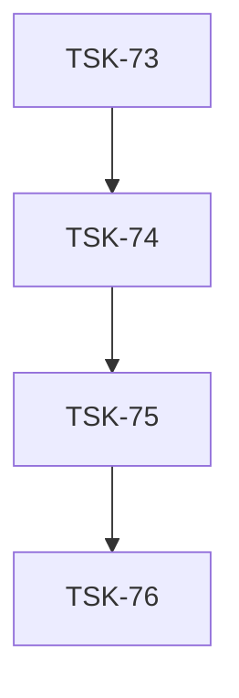

# Tasks: ai-tsx

## Scope Spec

- [Scope spec](../../specs/ai-tsx/ai-tsx.spec.md)

## Cascade Table

Effective rules for tasks in this scope. Derived from scope graph (depends-on transitive closure).

Tier order (low → high priority on collision): `traversed-scopes` → `target-scope` → `module:<name>` → `task`.

| Tier                   | coding           | testing   |
| ---------------------- | ---------------- | --------- |
| prompt-kit (traversed) | typescript-rules | —         |
| ai-tsx (target)        | typescript-rules | node-test |
| module:elements        | —                | None      |
| module:components      | —                | None      |
| module:directives      | —                | None      |

### Rule Sources

- Traversed scopes: [scope graph](../../specs/README.md)
- Target scope: [ai-tsx spec 3.5](../../specs/ai-tsx/ai-tsx.spec.md)
- Module: each module's 10 Handoff
- Files: `ai/directives/coding/typescript-rules.xml`, `ai/directives/testing/node-test.xml`

## Intra-Scope DAG

## Tracker

| Task-ID                                    | Title                                                                       | Module     | Dependencies         | Status     | Reopens |
| ------------------------------------------ | --------------------------------------------------------------------------- | ---------- | -------------------- | ---------- | ------- |
| [TSK-73](ai-tsx.task-73.md)                | Bootstrap: exports + структура + tsconfig                                   | N/A        | prompt-kit bootstrap | `[x]` DONE | 0       |
| [TSK-74](elements/elements.task-74.md)     | Реализовать elements: Pattern, Snippet, Hook, AntiPattern, Good, Definition | elements   | TSK-73               | [x] DONE   | 0       |
| [TSK-75](components/components.task-75.md) | Реализовать компоненты: CodePatternsBlock, AntiPatternsBlock, ...           | components | TSK-74               | [x] DONE   | 0       |
| [TSK-76](directives/directives.task-76.md) | Реализовать пилотные директивы + утилиты                                    | directives | TSK-75               | [x] DONE   | 0       |

## Notes

- TSK-73 зависит от prompt-kit bootstrap (prompt-kit в exports package.json)
- После пилота — v2 с оставшимися 30+ директивами
