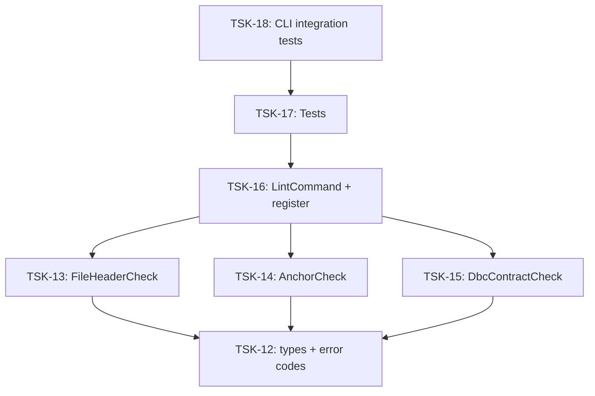

# Tasks: cli

## Scope Spec

- [Scope spec](../../specs/cli/cli.spec.md)

## Cascade Table

Effective rules for tasks in this scope. Derived from scope graph (depends-on transitive closure).

Tier order (low → high priority on collision): `traversed-scopes` → `target-scope` → `module:<name>` → `task`.

| Tier                   | coding           | testing   |
| ---------------------- | ---------------- | --------- |
| infra-base (traversed) | typescript-rules | node-test |
| dbc (traversed)        | typescript-rules | node-test |
| cli (target)           | typescript-rules | node-test |
| module:lint            | —                | —         |

### Rule Sources

- Traversed scopes: [scope graph](../../specs/README.md)
- Target scope: [cli spec §4.5](../../specs/cli/cli.spec.md)
- Module: [lint spec §9](../../specs/cli/lint/lint.spec.md)
- Files: `ai/directives/coding/typescript-rules.xml`, `ai/directives/testing/node-test.xml`

## Intra-Scope DAG

## Tracker

| Task-ID                            | Title                               | Module | Dependencies           | Status     | Reopens |
| ---------------------------------- | ----------------------------------- | ------ | ---------------------- | ---------- | ------- |
| [TSK-12](lint/cli-lint.task-12.md) | Типы: LintError, LintOptions, коды  | lint   | None                   | `[x]` DONE | 0       |
| [TSK-13](lint/cli-lint.task-13.md)         | FileHeaderCheck                      | lint   | TSK-12              | `[x]` DONE | 0       |
| [TSK-14](lint/cli-lint.task-14.md)         | AnchorCheck                          | lint   | TSK-12              | `[x]` DONE | 0       |
| [TSK-15](lint/cli-lint.task-15.md)         | DbcContractCheck                     | lint   | TSK-12, TSK-11      | `[x]` DONE | 0       |
| [TSK-16](lint/cli-lint.task-16.md)         | LintCommand + регистрация в gennady  | lint   | TSK-13, TSK-14, TSK-15 | `[x]` DONE | 0       |
| [TSK-17](lint/cli-lint.task-17.md)         | Тесты: проверки + интеграционные     | lint   | TSK-16              | `[x]` DONE | 0       |
| [TSK-18](lint/cli-lint.task-18.md)         | Интеграционные тесты CLI команды lint | lint   | TSK-17              | `[x]` DONE | 0       |

## Notes

- TSK-11 (dbc refine: опция content) — внешняя зависимость для TSK-15
- `cli/gennady.ts` и `cli/AGENTS.md` обновляются в TSK-16
- `cli/cmd/lint/` уже существует (пустая, с устаревшим `lint-cmd.task.spec.md`)
