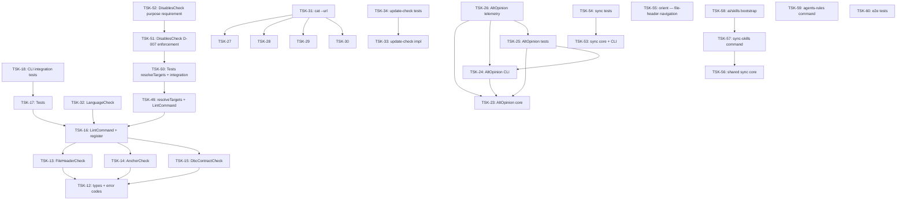

# Tasks: cli

## Scope Spec

- [Scope spec](../../specs/cli/cli.spec.md)

## Cascade Table

Effective rules for tasks in this scope. Derived from scope graph (depends-on transitive closure).

Tier order (low → high priority on collision): `traversed-scopes` → `target-scope` → `module:<name>` → `task`.

| Tier                   | coding           | testing   |
| ---------------------- | ---------------- | --------- |
| infra-base (traversed) | typescript-rules | node-test |
| dbc (traversed)        | typescript-rules | node-test |
| cli (target)           | typescript-rules | node-test |
| module:lint            | —                | —         |
| module:update-check    | —                | —         |
| module:sync            | —                | —         |
| module:sync-skills     | —                | —         |
| module:orient          | —                | —         |
| module:agents-rules    | —                | —         |

### Rule Sources

- Traversed scopes: [scope graph](../../specs/README.md)
- Target scope: [cli spec §4.5](../../specs/cli/cli.spec.md)
- Module: [lint spec §9](../../specs/cli/lint/lint.spec.md)
- Module: [update-check spec §9](../../specs/cli/update-check/update-check.spec.md)
- Module: [sync spec §9](../../specs/cli/sync/sync.spec.md)
- Module: [sync-skills spec §10](../../specs/cli/sync-skills/sync-skills.spec.md)
- Module: orient — [cli spec §3.5 + §4.1.5](../../specs/cli/cli.spec.md#35-orient-dx)
- Module: [agents-rules spec §9](../../specs/cli/agents-rules/agents-rules.spec.md)
- Files: `ai/directives/coding/typescript-rules.xml`, `ai/directives/testing/node-test.xml`

## Intra-Scope DAG

## Tracker

| Task-ID                                          | Title                                                 | Module       | Dependencies                   | Status     | Reopens |
| ------------------------------------------------ | ----------------------------------------------------- | ------------ | ------------------------------ | ---------- | ------- |
| [TSK-12](lint/cli-lint.task-12.md)               | Типы: LintError, LintOptions, коды                    | lint         | None                           | `[x]` DONE | 1       |
| [TSK-13](lint/cli-lint.task-13.md)               | FileHeaderCheck                                       | lint         | TSK-12                         | `[x]` DONE | 1       |
| [TSK-14](lint/cli-lint.task-14.md)               | AnchorCheck                                           | lint         | TSK-12                         | `[x]` DONE | 2       |
| [TSK-15](lint/cli-lint.task-15.md)               | DbcContractCheck                                      | lint         | TSK-12, TSK-11                 | `[x]` DONE | 1       |
| [TSK-16](lint/cli-lint.task-16.md)               | LintCommand + регистрация в gennady                   | lint         | TSK-13, TSK-14, TSK-15         | `[x]` DONE | 1       |
| [TSK-17](lint/cli-lint.task-17.md)               | Тесты: проверки + интеграционные                      | lint         | TSK-16                         | `[x]` DONE | 1       |
| [TSK-18](lint/cli-lint.task-18.md)               | Интеграционные тесты CLI команды lint                 | lint         | TSK-17                         | `[x]` DONE | 1       |
| [TSK-32](lint/cli-lint.task-32.md)               | LanguageCheck: проверка языка (English-only)          | lint         | TSK-16                         | `[x]` DONE | 1       |
| [TSK-49](lint/cli-lint.task-49.md)               | resolveTargets() + интеграция в LintCommand           | lint         | TSK-16                         | `[x]` DONE | 1       |
| [TSK-50](lint/cli-lint.task-50.md)               | Тесты: resolveTargets (24u) + интеграционные (19i)    | lint         | TSK-49                         | `[x]` DONE | 1       |
| [TSK-51](lint/cli-lint.task-51.md)               | DisablesCheck (D-007 enforcement)                     | lint         | TSK-50                         | `[x]` DONE | 1       |
| [TSK-52](lint/cli-lint.task-52.md)               | DisablesCheck purpose requirement (D-007 tighten)     | lint         | TSK-51                         | `[x]` DONE | 1       |
| [TSK-23](alt-opinion/cli-alt-opinion.task-23.md) | AltOpinion Core (types + parser + runner)             | alt-opinion  | None                           | `[x]` DONE | 5       |
| [TSK-24](alt-opinion/cli-alt-opinion.task-24.md) | AltOpinion CLI (cmd + prompts + registration)         | alt-opinion  | TSK-23                         | `[x]` DONE | 1       |
| [TSK-25](alt-opinion/cli-alt-opinion.task-25.md) | AltOpinion Tests (parser + runner + integration)      | alt-opinion  | TSK-23, TSK-24                 | `[x]` DONE | 1       |
| [TSK-26](alt-opinion/cli-alt-opinion.task-26.md) | AltOpinion Telemetry (port + runner + output + tests) | alt-opinion  | TSK-23, TSK-24, TSK-25         | `[x]` DONE | 1       |
| [TSK-31](cat/cli-cat.task-31.md)                 | cat --url: поддержка GitLab MR / GitHub PR            | cat          | TSK-27, TSK-28, TSK-29, TSK-30 | `[x]` DONE | 1       |
| [TSK-33](update-check/update-check.task-33.md)   | Bootstrap + Impl: update-check механизм               | update-check | None                           | `[x]` DONE | 1       |
| [TSK-34](update-check/update-check.task-34.md)   | Tests: update-check (unit + integration)              | update-check | TSK-33                         | `[x]` DONE | 1       |
| [TSK-53](sync/cli-sync.task-53.md)               | Sync: core + CLI                                      | sync         | None                           | `[x]` DONE | 1       |
| [TSK-54](sync/cli-sync.task-54.md)               | Sync: Tests                                           | sync         | TSK-53                         | `[x]` DONE | 1       |
| [TSK-55](orient/orient.task-55.md)               | orient: file-header + DBC навигация (S1-S9)           | orient       | None                           | `[x]` DONE | 1       |
| [TSK-56](sync-skills/cli-sync-skills.task-56.md) | Extract shared sync core + refactor sync              | sync-skills  | TSK-53, TSK-54                 | `[x]` DONE | 1       |
| [TSK-57](sync-skills/cli-sync-skills.task-57.md) | sync-skills command (types, core, fmt, CLI, tests)    | sync-skills  | TSK-56                         | `[x]` DONE | 1       |
| [TSK-58](sync-skills/cli-sync-skills.task-58.md) | ai/skills bootstrap (13 SDD skills)                   | sync-skills  | TSK-57                         | `[ ]` TODO | 1       |
| [TSK-59](agents-rules/agents-rules.task-59.md)   | agents-rules: команда документации orient для агентов | agents-rules | None                           | `[x]` DONE | 0       |
| [TSK-60](e2e/e2e.task-60.md)                     | E2E-тесты CLI-команд через npm pack                   | e2e          | None                           | `[x]` DONE | 3       |

## Notes

- TSK-11 (dbc refine: опция content) — внешняя зависимость для TSK-15
- `cli/gennady.ts` и `cli/AGENTS.md` обновляются в TSK-16, TSK-24, TSK-53, TSK-55
- `cli/cmd/lint/` уже существует (пустая, с устаревшим `lint-cmd.task.spec.md`)
