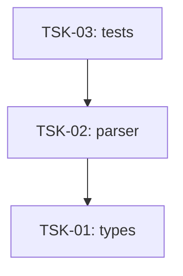

# Tasks: dbc

## Scope Spec

- [Scope spec](../../specs/dbc/dbc.spec.md)

## Cascade Table

Effective rules for tasks in this scope. Derived from scope graph (depends-on transitive closure).

Tier order (low → high priority on collision): `traversed-scopes` → `target-scope` → `module:<name>` → `task`.

| Tier                   | coding           | testing   |
| ---------------------- | ---------------- | --------- |
| infra-base (traversed) | typescript-rules | node-test |
| dbc (target)           | typescript-rules | node-test |
| module:dbc-parser      | —                | —         |

### Rule Sources

- Traversed scopes: [scope graph](../../specs/README.md)
- Target scope: [dbc spec §3.5](../../specs/dbc/dbc.spec.md)
- Module: [dbc-parser spec §9](../../specs/dbc/dbc-parser/dbc-parser.spec.md)
- Files: `ai/directives/coding/typescript-rules.xml`, `ai/directives/testing/node-test.xml`

## Intra-Scope DAG

## Tracker

| Task-ID                                    | Title                                        | Module     | Dependencies | Status            | Reopens |
| ------------------------------------------ | -------------------------------------------- | ---------- | ------------ | ----------------- | ------- |
| [TSK-01](dbc-parser/dbc-parser.task-01.md) | Обновить типы: format + inline               | dbc-parser | None         | `[x]` DONE        | 0       |
| [TSK-02](dbc-parser/dbc-parser.task-02.md) | Обновить парсер: implements + order + inline | dbc-parser | TSK-01       | `[x]` DONE        | 0       |
| [TSK-03](dbc-parser/dbc-parser.task-03.md) | Обновить тесты и snapshot-ы | dbc-parser | TSK-02 | `[x]` DONE | 0 |

## Notes

- Инфраструктура уже настроена, bootstrap не требуется.
- `#logger` доступен через `package.json` imports.
