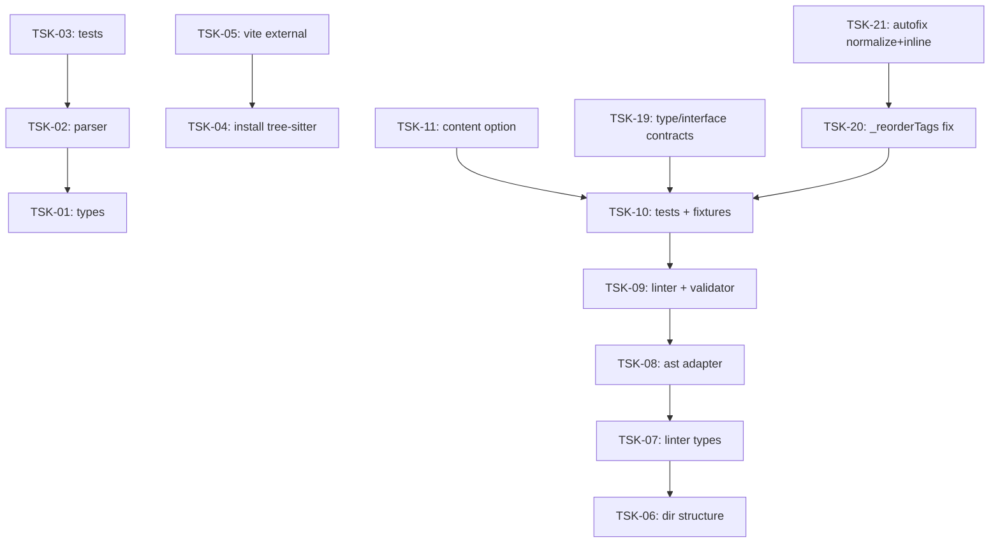

# Tasks: dbc

## Scope Spec

- [Scope spec](../../specs/dbc/dbc.spec.md)

## Cascade Table

Effective rules for tasks in this scope. Derived from scope graph (depends-on transitive closure).

Tier order (low → high priority on collision): `traversed-scopes` → `target-scope` → `module:<name>` → `task`.

| Tier                   | coding           | testing   |
| ---------------------- | ---------------- | --------- |
| infra-base (traversed) | typescript-rules | node-test |
| dbc (target)           | typescript-rules | node-test |
| module:dbc-parser      | —                | —         |
| module:dbc-linter      | —                | —         |

### Rule Sources

- Traversed scopes: [scope graph](../../specs/README.md)
- Target scope: [dbc spec §3.5](../../specs/dbc/dbc.spec.md)
- Module: [dbc-parser spec §9](../../specs/dbc/dbc-parser/dbc-parser.spec.md), [dbc-linter spec §9](../../specs/dbc/dbc-linter/dbc-linter.spec.md)
- Files: `ai/directives/coding/typescript-rules.xml`, `ai/directives/testing/node-test.xml`

## Intra-Scope DAG

## Tracker

| Task-ID                                    | Title                                             | Module     | Dependencies | Status     | Reopens |
| ------------------------------------------ | ------------------------------------------------- | ---------- | ------------ | ---------- | ------- |
| [TSK-01](dbc-parser/dbc-parser.task-01.md) | Обновить типы: format + inline                    | dbc-parser | None         | `[x]` DONE | 0       |
| [TSK-02](dbc-parser/dbc-parser.task-02.md) | Обновить парсер: implements + order + inline      | dbc-parser | TSK-01       | `[x]` DONE | 0       |
| [TSK-03](dbc-parser/dbc-parser.task-03.md) | Обновить тесты и snapshot-ы                       | dbc-parser | TSK-02       | `[x]` DONE | 0       |
| [TSK-04](dbc-linter/dbc-linter.task-04.md) | Bootstrap: установить tree-sitter                 | dbc-linter | None         | `[x]` DONE | 0       |
| [TSK-05](dbc-linter/dbc-linter.task-05.md) | Bootstrap: tree-sitter external в Vite            | dbc-linter | TSK-04       | `[x]` DONE | 0       |
| [TSK-06](dbc-linter/dbc-linter.task-06.md) | Bootstrap: создать структуру директорий           | dbc-linter | None         | `[x]` DONE | 0       |
| [TSK-07](dbc-linter/dbc-linter.task-07.md) | Типы: Ports, VO, константы                        | dbc-linter | TSK-06       | `[x]` DONE | 1       |
| [TSK-08](dbc-linter/dbc-linter.task-08.md) | DbcTsAstAdapter: tree-sitter парсинг TS           | dbc-linter | TSK-07       | `[x]` DONE | 2       |
| [TSK-09](dbc-linter/dbc-linter.task-09.md) | DbcTsLinter + DbcContractMatchValidator + autofix | dbc-linter | TSK-08       | `[x]` DONE | 2       |
| [TSK-10](dbc-linter/dbc-linter.task-10.md) | Тесты: 88 fixture-кейсов                          | dbc-linter | TSK-09       | `[x]` DONE | 1       |
| [TSK-11](dbc-linter/dbc-linter.task-11.md) | DbcLinter: опция `content`                        | dbc-linter | TSK-10       | `[x]` DONE | 1       |
| [TSK-19](dbc-linter/dbc-linter.task-19.md) | type alias + interface property контракты         | dbc-linter | TSK-10       | `[x]` DONE | 0       |
| [TSK-20](dbc-linter/dbc-linter.task-20.md) | Fix \_reorderTags: \*/ boundary + edge cases      | dbc-linter | TSK-10       | `[x]` DONE | 0       |
| [TSK-21](dbc-linter/dbc-linter.task-21.md) | Autofix: normalize multi-line + expand inlining   | dbc-linter | TSK-20       | `[x]` DONE | 0       |

## Notes

- Инфраструктура уже настроена, bootstrap не требуется.
- `#logger` доступен через `package.json` imports.
