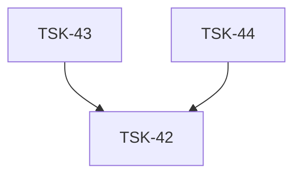

# Tasks: infra-npm-publish

## Scope Spec

- [Scope spec](../../specs/infra-npm-publish/infra-npm-publish.spec.md)

## Cascade Table

Effective rules for tasks in this scope. Derived from scope graph (depends-on transitive closure).

Tier order (low → high priority on collision): `traversed-scopes` → `target-scope` → `module:<name>` → `task`.

| Tier                       | coding | testing   | infra                       |
| -------------------------- | ------ | --------- | --------------------------- |
| infra-base (traversed)     | —      | node-test | git-setup, nodejs-npm-setup |
| infra-npm-publish (target) | —      | —         | nodejs-npm-setup            |

### Rule Sources

- Traversed scopes: [scope graph](../../specs/README.md)
- Target scope: [infra-npm-publish spec 5](../../specs/infra-npm-publish/infra-npm-publish.spec.md)
- Files: `ai/directives/<category>/<rule>.xml`

## Intra-Scope DAG

## Tracker

| Task-ID                                | Title                                        | Module | Dependencies | Status     | Reopens |
| -------------------------------------- | -------------------------------------------- | ------ | ------------ | ---------- | ------- |
| [TSK-42](infra-npm-publish.task-42.md) | Установить release-it как devDependency      | N/A    | None         | `[x]` DONE | 0       |
| [TSK-43](infra-npm-publish.task-43.md) | Создать `.release-it.json`                   | N/A    | TSK-42       | `[x]` DONE | 0       |
| [TSK-44](infra-npm-publish.task-44.md) | Добавить `"release"` script в `package.json` | N/A    | TSK-42       | `[x]` DONE | 0       |

## Внешние предусловия

- `operator-action`: оператор должен быть залогинен в npm (`npm whoami`)

## Notes

None.
