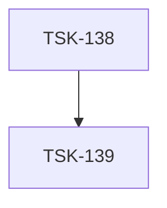

# Tasks: mr-stats

## Scope Spec

- [Scope spec](../../specs/mr-stats/mr-stats.spec.md)

## Cascade Table

Effective rules for tasks in this scope. Derived from scope graph (depends-on: infra-base → mr-stats).

Tier order (low → high priority on collision): `traversed-scopes` → `target-scope` → `module:<name>` → `task`.

| Tier                   | coding           | infra                                     |
| ---------------------- | ---------------- | ----------------------------------------- |
| infra-base (traversed) | typescript-rules | eslint-setup, git-setup, nodejs-npm-setup |
| mr-stats (target)      | typescript-rules | nodejs-npm-setup, git-setup               |

### Rule Sources

- Traversed: [infra-base spec](../../specs/infra-base/infra-base.spec.md)
- Target: [mr-stats spec §4.5](../../specs/mr-stats/mr-stats.spec.md)
- Files: `ai/directives/coding/typescript-rules.xml`, `ai/directives/infra/nodejs-npm-setup.xml`, `ai/directives/infra/git-setup.xml`

## Intra-Scope DAG

## Tracker

| Task-ID                         | Title                                          | Module | Dependencies | Status     | Reopens |
| ------------------------------- | ---------------------------------------------- | ------ | ------------ | ---------- | ------- |
| [TSK-138](mr-stats.task-138.md) | Bootstrap: classifier config + CLI scaffolding | N/A    | None         | `[x]` DONE | 0       |
| [TSK-139](mr-stats.task-139.md) | Core: mr-stats implementation                  | N/A    | TSK-138      | `[x]` DONE | 0       |

## Notes

- Для `totalRealCodeLines` оговорка: используется значение из jscpd (passthrough).
- Тестовый MR: https://gitlab.corp.mail.ru/mail/messenger/-/merge_requests/14 (Plan 5 волна 1 — dumb-компоненты + pixel-verify pipeline) — наиболее разнообразный по типам файлов.
