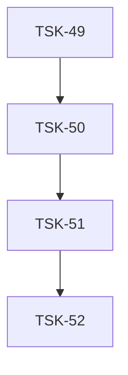

# Tasks: prompt-kit

## Scope Spec

- [Scope spec](../../specs/prompt-kit/prompt-kit.spec.md)

## Cascade Table

Effective rules for tasks in this scope. Derived from scope graph (depends-on transitive closure).

Tier order (low → high priority on collision): `traversed-scopes` → `target-scope` → `module:<name>` → `task`.

| Tier                   | coding           | testing   | architecture | infra |
| ---------------------- | ---------------- | --------- | ------------ | ----- |
| infra-base (traversed) | —                | —         | —            | —     |
| prompt-kit (target)    | typescript-rules | —         | —            | —     |
| module:core            | —                | node-test | —            | —     |
| module:elements        | —                | —         | —            | —     |
| module:format          | —                | —         | —            | —     |

### Rule Sources

- Traversed scopes: [scope graph](../../specs/README.md)
- Target scope: [prompt-kit spec 3.5](../../specs/prompt-kit/prompt-kit.spec.md)
- Module: each module's 10 Handoff
- Files: `ai/directives/<category>/<rule>.xml`

## Intra-Scope DAG

## Tracker

| Task-ID                                | Title                | Module   | Dependencies   | Status     | Reopens |
| -------------------------------------- | -------------------- | -------- | -------------- | ---------- | ------- |
| [TSK-49](prompt-kit.task-49.md)        | Bootstrap prompt-kit | —        | —              | `[ ]` TODO | 0       |
| [TSK-50](format/format.task-50.md)     | Format module        | format   | TSK-49         | `[ ]` TODO | 0       |
| [TSK-51](core/core.task-51.md)         | Core module          | core     | TSK-49, TSK-50 | `[ ]` TODO | 0       |
| [TSK-52](elements/elements.task-52.md) | Elements module      | elements | TSK-49, TSK-51 | `[ ]` TODO | 0       |

## Notes

- Фикстуры — primary validation для всех модулей. Каждый тестовый сценарий проверяется через `input.tsx → expected.xml + expected.md`.
- Unit-тесты — дополнительно для граничных значений (SpacingEngine, ListPunctuation, AnchorBuilder, TableRenderer, JSXTreeNormalizer).
