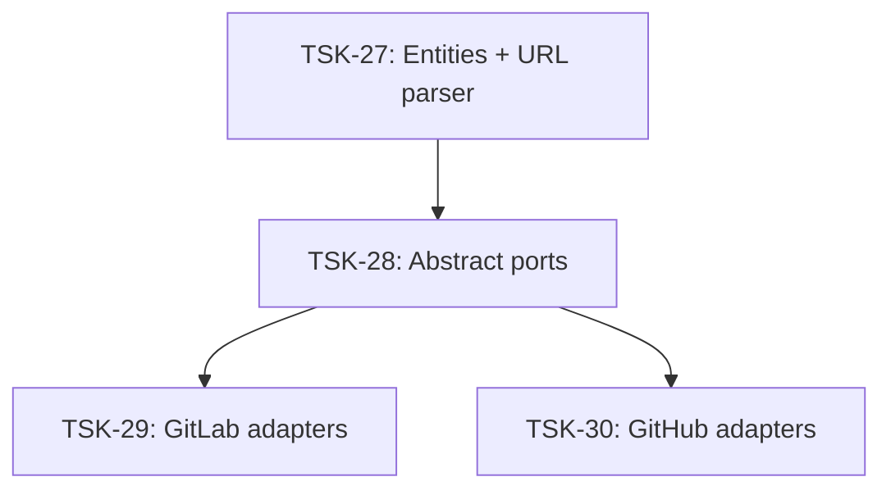

# Tasks: vcs

## Scope Spec

- [Scope spec](../../specs/vcs/vcs.spec.md)

## Cascade Table

| Tier                   | coding           | testing   |
| ---------------------- | ---------------- | --------- |
| infra-base (traversed) | typescript-rules | node-test |
| vcs (target)           | typescript-rules | —         |
| module:vcs-client      | —                | —         |

## Intra-Scope DAG

## Tracker

| Task-ID                                    | Title                                                                     | Module     | Dependencies | Status     | Reopens |
| ------------------------------------------ | ------------------------------------------------------------------------- | ---------- | ------------ | ---------- | ------- |
| [TSK-22](vcs-client/vcs-client.task-22.md) | file headers + DBC contracts                                              | vcs-client | None         | `[x]` DONE | 0       |
| [TSK-27](vcs-client/vcs-client.task-27.md) | Entities + URL parser                                                     | vcs-client | None         | `[x]` DONE | 0       |
| [TSK-28](vcs-client/vcs-client.task-28.md) | Abstract ports (RepositoryFiles + optional MergeDiscussions + getChanges) | vcs-client | TSK-27       | `[x]` DONE | 0       |
| [TSK-29](vcs-client/vcs-client.task-29.md) | GitLab adapters (RepositoryFiles + getChanges)                            | vcs-client | TSK-28       | `[x]` DONE | 0       |
| [TSK-30](vcs-client/vcs-client.task-30.md) | GitHub adapters (Client + MergeRequests + RepositoryFiles)                | vcs-client | TSK-28       | `[x]` DONE | 0       |
