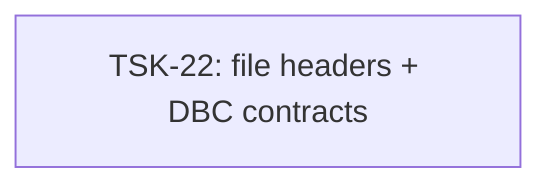

# Tasks: vcs

## Scope Spec

- [Scope spec](../../specs/vcs/vcs.spec.md)

## Cascade Table

| Tier                   | coding           | testing   |
| ---------------------- | ---------------- | --------- |
| infra-base (traversed) | typescript-rules | node-test |
| vcs (target)           | typescript-rules | —         |
| module:vcs-client      | —                | —         |

## Intra-Scope DAG

## Tracker

| Task-ID | Title | Module | Dependencies | Status | Reopens |
|---|---|---|---|---|---|
| [TSK-22](vcs-client/vcs-client.task-22.md) | file headers + DBC contracts | vcs-client | None | `[x]` DONE | 0 |
